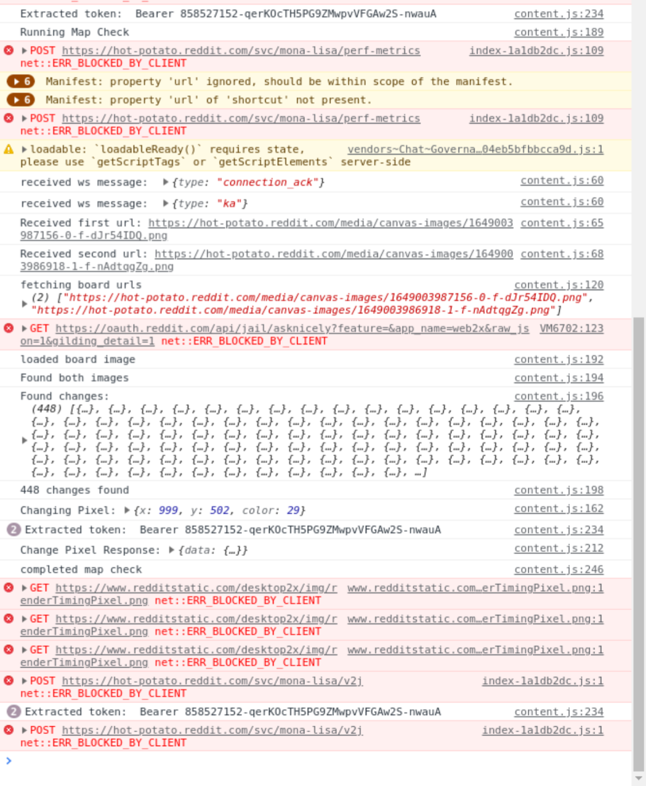

# placebot

**WARNING: ONLY REDDIT ACCOUNTS WITH VERIFIED EMAIL ARE SUPPORTED.** If your account has a 20 minutes rate limit, this will probably work, but will send more requests than necessary.

## How to use

- Use a chromium based browser
- Log in to reddit
- Go to your extension page (chrome://extensions/)
- Load the unpacked extension. You might have to enable developer mode
- Go to /r/place
- Press CTRL-SHIFT-I to open up developer tools and go to the console page. You should see something like this:

## Use multiple accounts

You can use multiple accounts by opening multiple browser windows in private mode.
